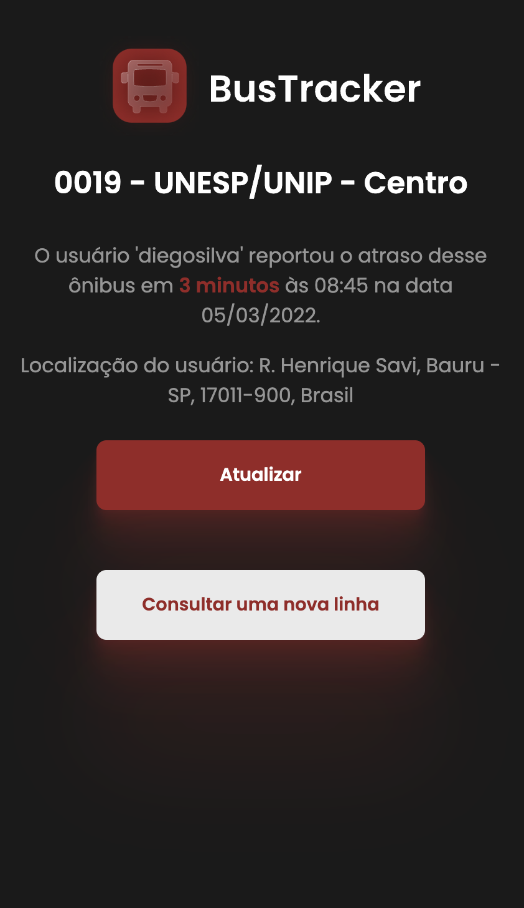
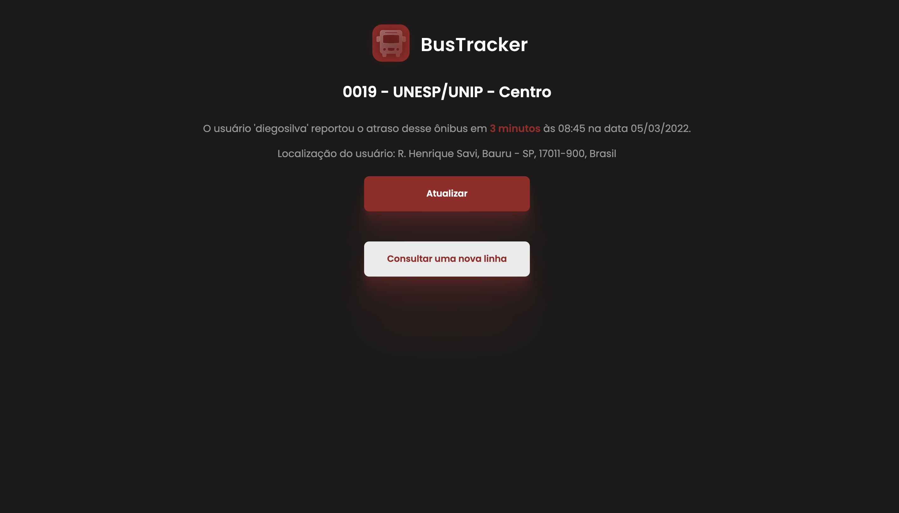

<h1 align="center">
    
</h1>

<h4 align="center"> 
	🚌 Bus Tracker 1.0 🚀 em construção... 🚧
</h4>

<p align="center">
  

  
  
  <a href="https://github.com/giovannamoeller/bus-line/commits/main">
    
  </a>

  
   <a href="https://github.com/giovannamoeller/bus-line/stargazers">
    
  </a>
</p>


## 💻 Sobre o projeto

♻️ BusTracker é um software feito para web com o objetivo de melhorar a produtividade dos usuários uma vez que reporta os atrasos dos ônibus da cidade de Bauru, São Paulo.

A ideia é toda centrada no usuário, pois são os mesmos que reportam os atrasos. A ideia de comunidade é extremamente importante aqui.

Os usuários podem se cadastrar para reportar atrasos, ou apenas continuarem como convidados para visualizar os atrasos.

Quando o usuário reportar novos atrasos, será necessário a permissão da sua localizacao, uma vez que é preciso saber em que ponto está atrasado determinado tempo.


## 🎨 Projeto de UI

### Mobile

<p align="center">
  
</p>

### Web

<p align="center" style="display: flex; align-items: flex-start; justify-content: center;">
  
</p>

## 🛠 Tecnologias

As seguintes ferramentas foram usadas na construção do projeto:

- ReactJS
- React Router DOM
- Styled Components
- Google Maps API

## 🚀 Como executar o projeto

Antes de começar, você vai precisar ter instalado em sua máquina as seguintes ferramentas:
[Git](https://git-scm.com), [Node.js][nodejs]. 
Além disto é bom ter um editor para trabalhar com o código como [VSCode][vscode]

### 🧭 Rodando a aplicação web (Front End)

```bash
# Clone este repositório
$ git clone https://github.com/giovannamoeller/bus-line

# Acesse a pasta do projeto no seu terminal/cmd
$ cd bus-line

# Instale as dependências
$ npm install

# Execute a aplicação em modo de desenvolvimento
$ npm run start

# A aplicação será aberta na porta:3000 - acesse http://localhost:3000
```

## 📝 Licença

Este projeto esta sobe a licença MIT.

Feito com ❤️ por Giovanna Moeller e Lucas Bertoni.